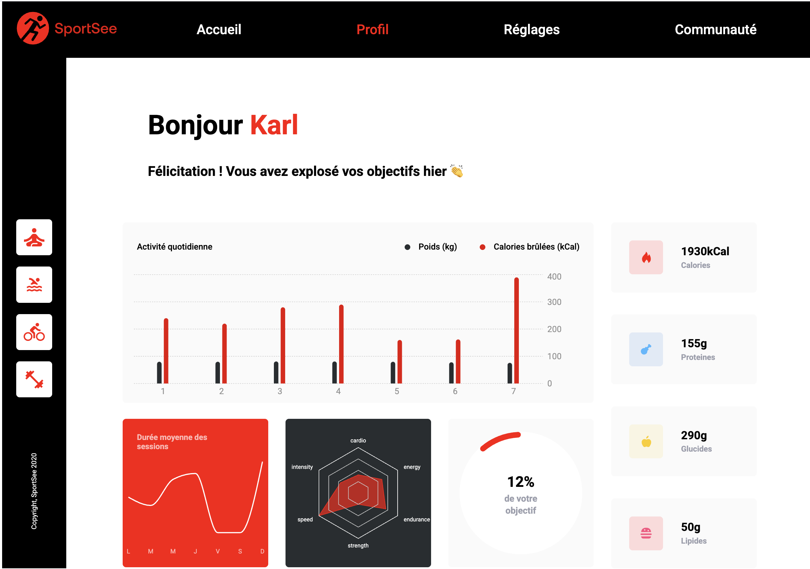

# SportSee


## Description du projet

SportSee est un tableau de bord d'analytics de coaching sportif. Ce projet consiste à développer une interface utilisateur moderne et interactive pour afficher des données d'analyse sportive sous forme de graphiques et de diagrammes.

L'objectif principal est de construire la page profil de l'utilisateur, intégrant des visualisations avancées pour présenter les données récupérées via une API.

## Objectifs pédagogiques

- Développer des éléments graphiques avancés à l'aide de bibliothèques JavaScript comme Recharts ou D3.
- Interagir avec un service Web en utilisant des bibliothèques comme Fetch ou Axios.
- Assurer la qualité des données d'une application.
- Documenter efficacement le code avec des outils comme JSDoc et PropTypes.

## Compétences développées

- Création d'interfaces utilisateur modernes avec React.
- Intégration de données complexes via des API.
- Utilisation de bibliothèques graphiques pour des visualisations interactives.
- Documentation et collaboration au sein d'une équipe de développement.

## Prérequis

Avant de commencer ce projet, il est recommandé de :

1. Lire toutes les sections du projet et les documents liés.
2. Prendre des notes sur ce que vous avez compris.
3. Consulter les étapes pour vous guider.
4. Préparer une liste de questions pour votre première session de mentorat.

## Technologies utilisées

- **Front-end** : React
- **Graphiques** : Recharts ou D3
- **HTTP** : Fetch ou Axios
- **Back-end** : Node.js (géré séparément)

## Installation et démarrage

1. Clonez le dépôt :
   ```bash
   git clone https://github.com/votre-utilisateur/sportSee.git
   ```
2. Installez les dépendances :
   ```bash
   npm install
   ```
3. Lancez l'application en mode développement :
   ```bash
   npm start
   ```

## Documentation

Une documentation complète est incluse dans le projet, comprenant :

- **README** : Ce fichier pour une vue d'ensemble.
- **JSDoc** : Documentation des fonctions et composants.
- **PropTypes** : Validation des props pour les composants React.

## Pourquoi ce projet est important ?

Le développement d'applications web modernes avec React et la capacité à intégrer des données complexes via des API sont des compétences très recherchées dans l'industrie. La maîtrise de bibliothèques graphiques avancées vous permettra de créer des visualisations interactives et attrayantes, essentielles pour les applications orientées données.

## Contribution

Les contributions sont les bienvenues. Veuillez soumettre une pull request ou ouvrir une issue pour discuter des modifications.

## Licence

Ce projet est sous licence MIT. Consultez le fichier `LICENSE` pour plus d'informations.
